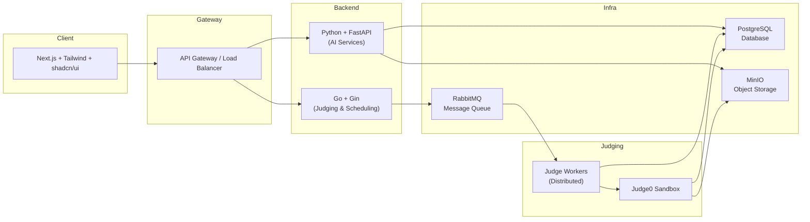

# **Codyssey**

> 一个面向算法竞赛与日常教学的在线判题系统（OJ），集成 AI 出题与智能检测功能。

---

## 快速开始（新增）

```bash
# 克隆仓库后
cp .env.example .env
cd infra
docker compose up --build -d
```

服务可用性检查：
- Go 后端: `curl http://localhost:8080/health`
- Python AI: `curl http://localhost:8000/health`
- 前端: 打开浏览器访问 http://localhost:3000

更多细节见 `docs/setup.md`。

---

## 项目简介

**Codyssey** 是一个支持 **算法竞赛、日常练习、考试场景** 的在线判题系统。

与传统 OJ 不同，它引入了 AI 技术：

* **AI 出题** ：通过调用大模型 API 自动生成题目，并保存到题库。
* **AI 检测** ：可选开启，对学生提交的代码进行分析，判断是否可能由 AI 自动生成。

系统设计上强调  **高并发、可扩展、解耦合** ，确保能够应对大规模考试/竞赛场景。

---

## 技术栈

### 前端

* **Next.js** ：用于实现竞赛/练习的交互界面。
* **Tailwind CSS**
* **shadcn/ui** （组件库，用于快速构建统一风格的界面）

### 后端

* **Go（Gin 框架）** ：
  * 用户管理、题目管理、比赛管理（当前初始化阶段仅健康检查与占位）
  * 判题任务调度、高并发处理（规划中）
* **Python（FastAPI 框架）** ：
  * AI 出题（调用大模型 API，当前为 stub）
  * AI 检测（深度学习模型，当前为 stub）
  * 智能化题库管理（规划中）

### 基础设施

* **数据库** ：PostgreSQL（存储用户、题目、提交记录等）
* **消息队列** ：RabbitMQ（分发判题任务、异步解耦）
* **对象存储** ：MinIO（存放题目文件、测试数据、用户上传文件）
* **代码沙箱** ：Judge0（Docker 隔离执行，确保安全性，后续添加）

---

## 系统架构概览



---

## 项目目录结构（已初始化）

```
codyssey/
├── backend/            # Go 后端 (Gin) - /health /version /problems 占位
├── python/             # Python FastAPI AI 服务 - /health /ai/generate /ai/detect
├── frontend/           # Next.js 前端
├── infra/              # docker-compose 与后续 IaC
├── docs/               # 文档（含 setup 指南）
└── README.md
```

---

## 核心功能（当前阶段状态）

| 功能 | 说明 | 当前状态 |
| ---- | ---- | -------- |
| 题目管理 | 题目 CRUD / AI 出题 | 规划 / stub |
| 竞赛管理 | 比赛创建、排名 | 规划 |
| 判题系统 | 队列 + Worker + Judge0 | 未实现 |
| AI 出题 | 调用大模型生成题目 | stub |
| AI 检测 | 代码风格检测 | stub |
| 健康检查 | /health | 已实现 |

---

## 开发与测试

### 开发模式选择

| 模式 | 描述 | 启动方式 | 优点 | 缺点 |
| ---- | ---- | -------- | ---- | ---- |
| Full Docker | 所有服务（前端/Go/Python/DB/MQ/MinIO）均容器化 | `docker compose up -d` | 一致性高，隔离好 | 热重载慢、资源占用更高 |
| Hybrid (推荐) | 仅基础设施容器化，应用本地运行 | `docker compose -f infra/docker-compose.infra.yml up -d` + 本地 `go run`/`uvicorn`/`pnpm dev` | 开发体验佳、调试方便 | 需本地安装运行时 |

### Hybrid 模式快速启动

```bash
# 1. 启动基础设施
cp .env.example .env
docker compose -f infra/docker-compose.infra.yml up -d

# 2. 启动 Go 服务
cd backend && go run .

# 3. 启动 Python AI 服务
cd python && uvicorn main:app --reload --port ${PY_BACKEND_PORT:-8000}

# 4. 启动前端
cd frontend && pnpm install && pnpm dev
```

### 全容器模式快速启动

```bash
cp .env.example .env
cd infra
docker compose up --build -d
```

```bash
# Go 本地测试
(cd backend && go test ./...)

# Python 本地测试
(cd python && pytest -q)
```

---

## 下一步计划

1. 集成数据库访问层（Go + GORM 或 sqlc）
2. 引入判题任务实体与消息发布逻辑
3. 添加 Judge Worker 原型与 Judge0 对接
4. Python 侧接入真实 AI 提供商（OpenAI / 本地 LLM）
5. 统一认证与权限模型
6. 提供 API 文档（OpenAPI / Swagger）

---

## License
待补充
