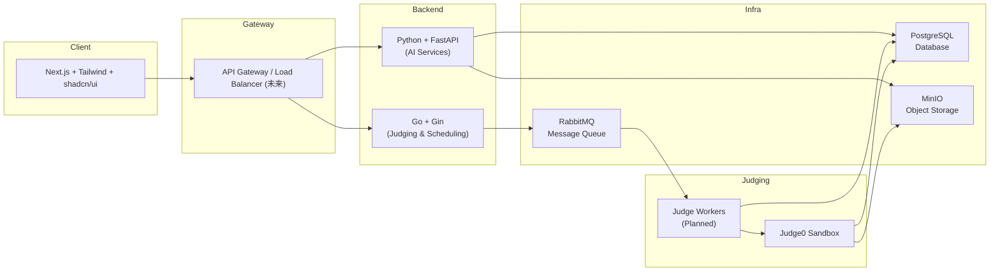

## 系统架构概览

本项目 Codyssey 旨在构建一个支持在线判题、竞赛、学习训练与 AI 助力功能的可扩展平台。

### 顶层组件

| 组件 | 语言/技术 | 角色 |
| ---- | -------- | ---- |
| 前端 (frontend) | Next.js + Tailwind + shadcn/ui | 交互界面、题目浏览、提交、竞赛 UI |
| Go 后端 (backend) | Go + Gin | API 网关（阶段性），题目/判题调度核心、后续扩展 Auth、竞赛、提交、评测流水线 |
| Python AI 服务 (python) | FastAPI | 题目生成（生成式 AI）、AI 检测（代码相似度/可疑度分析） |
| PostgreSQL | 数据库 | 持久化用户/题目/比赛/提交等结构化数据 |
| RabbitMQ | 消息队列 | 判题任务分发、异步事件 |
| MinIO | 对象存储 | 题目附件、测试数据、用户上传、判题工件 |
| Judge0 | 代码执行沙箱 | 隔离执行用户代码，收集运行结果（计划集成） |

### 体系结构图（Mermaid）

### 数据与控制流（简述）

1. 用户在前端提交代码 → Go 后端接收，写入 DB 并投递判题消息到 MQ。
2. Worker（未来模块）消费消息，准备测试数据（MinIO），调用 Judge0 执行。
3. 运行结果写回 DB，并通过 WebSocket/轮询反馈前端。
4. AI 出题：管理端调用 Python 服务生成题目，写入数据库与对象存储（若有附件）。
5. AI 检测：提交完成后可异步触发检测并附加元数据（风险分数）。

### 架构演进阶段

| 阶段 | 目标 | 说明 |
| ---- | ---- | ---- |
| MVP-1 | 基础 CRUD + 健康检查 | 已实现 Problem CRUD、统一响应格式、测试框架 |
| MVP-2 | 提交/判题流水线雏形 | 引入 Submission / Queue / Worker stub |
| MVP-3 | AI 题目生成与缓存 | AI 接口、内容审查/降重策略 |
| SCALE | 并发扩展与可观测性 | 分布式 Worker、Tracing、Metrics、分库分表预案 |

### 非功能性目标

* 可测试性：分层、内存仓储、接口抽象。
* 可观测性：后续接入日志结构化、Prometheus、OpenTelemetry。
* 演进友好：初期简化（轻迁移、直接 CRUD），逐步引入复杂组件（限流、缓存、分布式 ID、分片）。

---
更多运行细节参见 `development.md` 与后端分层见 `go-backend.md`。
