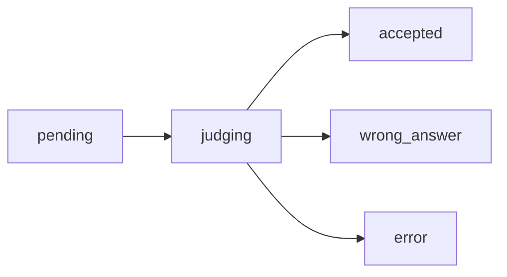
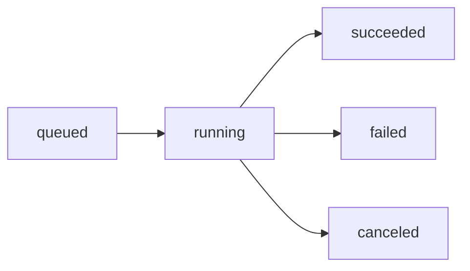
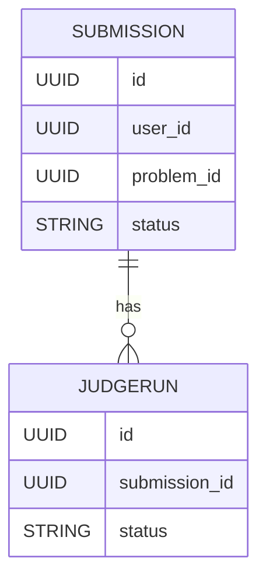

# 领域模型与状态机 (Domain Model)

本文聚焦当前已实现或已建模的数据实体及其状态机：`Submission`、`JudgeRun`。后续新增实体（Contest、Ranking、AIAnalysis 等）可按相同步骤扩展。

## 1. Submission

### 1.1 目的
表示用户对某题目的代码提交记录，是用户视角的“最终结果”载体。其评测可由 1..N 个 `JudgeRun` 支撑（未来支持多语言或重判）。

### 1.2 字段（核心）
| 字段 | 类型 | 说明 |
| ---- | ---- | ---- |
| id | UUID | 主键 |
| user_id | UUID | 提交者 |
| problem_id | UUID | 题目 |
| status | ENUM | 当前聚合状态（由评测结果驱动） |
| created_at | timestamptz | 创建时间 |
| updated_at | timestamptz | 更新时间 |
| version | INT | 乐观锁版本号（每次状态或关键字段更新自增） |

### 1.3 状态机
```
 pending -> judging -> ( accepted | wrong_answer | error )
```
非法流转：
- 任何终止状态（accepted / wrong_answer / error）不可再前进或回退
- 跳过 `judging` 直接终止 → `INVALID_TRANSITION`
- 未知目标状态值 → `INVALID_STATUS`

Mermaid 可视化：


### 1.4 失败与重新评测（规划）
- 重判（rejudge）策略：创建新的 JudgeRun 批次并更新 Submission 聚合规则。
- 聚合策略：首次 AC 即锁定（或允许配置：最新结果 / 最优结果）。

## 2. JudgeRun

### 2.1 目的
表示一次具体判题执行（调度 → 沙箱执行 → 结果采集）。可视为底层工作单元；一个 Submission 可关联多次 JudgeRun（重判、不同执行环境等）。

### 2.2 字段（核心）
| 字段 | 类型 | 说明 |
| ---- | ---- | ---- |
| id | UUID | 主键 |
| submission_id | UUID | 所属 Submission |
| status | ENUM | 判题执行状态 |
| created_at | timestamptz | 创建时间 |
| updated_at | timestamptz | 更新时间 |
| started_at | timestamptz | 进入 running 时间（用于耗时统计） |
| finished_at | timestamptz | 结束时间（与 started_at 差值形成运行总耗时） |

### 2.3 状态机
```
 queued -> running -> ( succeeded | failed | canceled )
```
非法流转：
- 直接从 queued 跳到终止状态（除 running）
- 终止后再次更新
- 未知状态值 → `INVALID_STATUS`
- 不符合链路顺序 → `INVALID_TRANSITION`

并发与冲突语义：
* Submission：使用 `version` 字段进行乐观锁（`UPDATE ... WHERE id=? AND version=?`）。成功后版本号自增；版本不匹配返回 `CONFLICT`。
* JudgeRun：使用状态条件更新 (`WHERE status='queued'` / `WHERE status='running'`) 作为轻量乐观控制。受影响行数为 0 时：
  * 记录不存在 → `JUDGE_RUN_NOT_FOUND` (404)
  * 记录存在但状态已被其它并发操作修改 → `CONFLICT` (409)
* 内存与 PG 实现均暴露对应 `ErrSubmissionConflict` / `ErrJudgeRunConflict`。

运行时长指标：
- 在 `Finish` 成功后，如果 `started_at` 与 `finished_at` 存在且顺序合法，记录 Prometheus Histogram: `codyssey_judge_run_duration_seconds{status="<terminal>"}`。
- 用途：观察不同终态的执行时间分布；可用于识别超时、沙箱性能波动。示例：
  ```promql
  histogram_quantile(0.95, sum by (le) (rate(codyssey_judge_run_duration_seconds_bucket[5m])))
  ```

Mermaid 可视化：


### 2.4 与 Submission 的关系
- 运行完成后（succeeded / failed / canceled）将影响 Submission 聚合逻辑：
  * succeeded + 判分 → 决定 Submission 是否 accepted / wrong_answer / error
  * failed → 可能映射为 Submission.error 或维持 judging（视重试策略）
- 后续：Submission 的最终状态可来自最新一次成功的 JudgeRun 结果。

## 3. 错误码与状态流转
| 场景 | 错误码 | HTTP | 触发条件 |
| ---- | ------ | ---- | -------- |
| 目标状态枚举无效 | INVALID_STATUS | 400 | 输入状态不在允许集合 |
| 状态链路非法 | INVALID_TRANSITION | 400 | 不符合状态图定义的有向边 |
| 目标对象缺失 | SUBMISSION_NOT_FOUND / JUDGE_RUN_NOT_FOUND | 404 | ID 不存在 |
| 竞争更新失败 | CONFLICT | 409 | 乐观锁 / 条件更新 0 行（例如并发状态更新或已被其它事务修改） |

## 4. 并发与一致性
Submission：版本号乐观锁防止“最后写入 wins”覆盖：
1. 读取返回当前 `version`。
2. 更新时携带期望版本；若行锁定失败（0 行受影响）说明版本已变 → `CONFLICT`。
3. 客户端策略：重新获取最新状态决定是否重试。

JudgeRun：依赖状态机单调（`queued->running->terminal`）的条件更新，避免并行重复启动或结束。

冲突可观测性：`submission_conflicts_total` / `judge_run_conflicts_total` 指标用于监测热点资源竞争，可辅助决定是否需要退避或分片。

## 5. 未来扩展点
| 方向 | 说明 |
| ---- | ---- |
| 分布式调度 | 引入队列优先级、抢占、限流维度（如题目/用户配额）。 |
| 计时指标 | 已实现：`judge_run_duration_seconds`（Histogram，标签：status） |
| 重判批次 | 增加 RejudgeBatch 实体，跟踪一次批量重判影响范围。 |
| 结果细粒度 | 引入 `test_case_results`（每个测试点耗时/内存/错误原因）。 |
| 失败分类 | 扩展 failed 细分类（编译错误/运行超时/内存超限/沙箱异常）。 |

## 6. 关联图（整体）


## 7. 维护策略
- 新增状态：需更新：枚举、服务层校验、`metrics` 标签、`domain-model.md`、错误码文档。
- 删除状态：需发布 BREAKING 说明，并迁移旧数据（DB / 代码 / 文档同步）。

---
如需扩展更多实体，请复制本文件结构：目的 → 字段 → 状态机 → 交互关系 → 错误 → 并发 → 扩展点。
